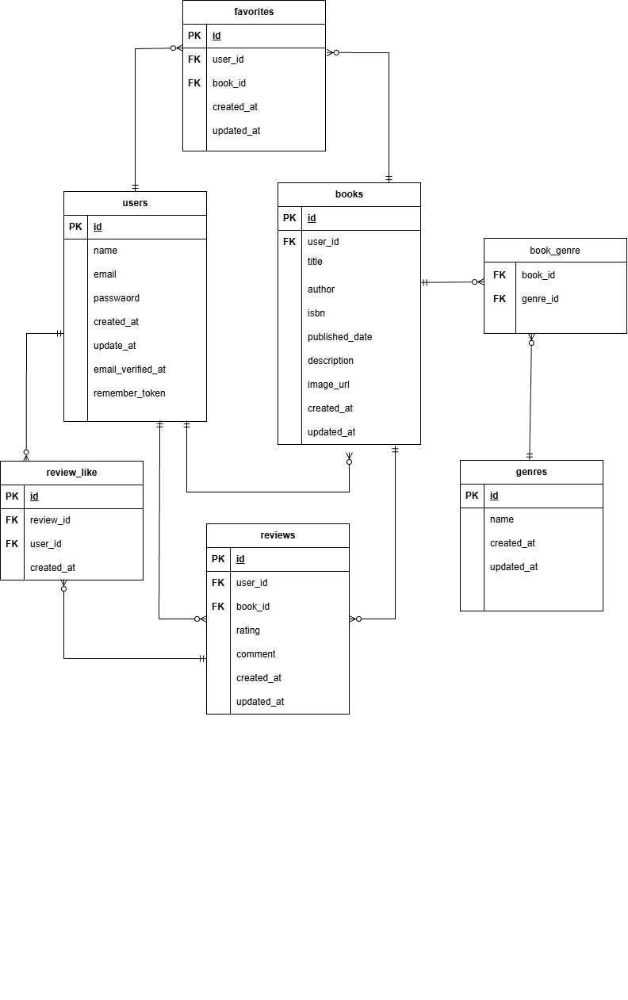
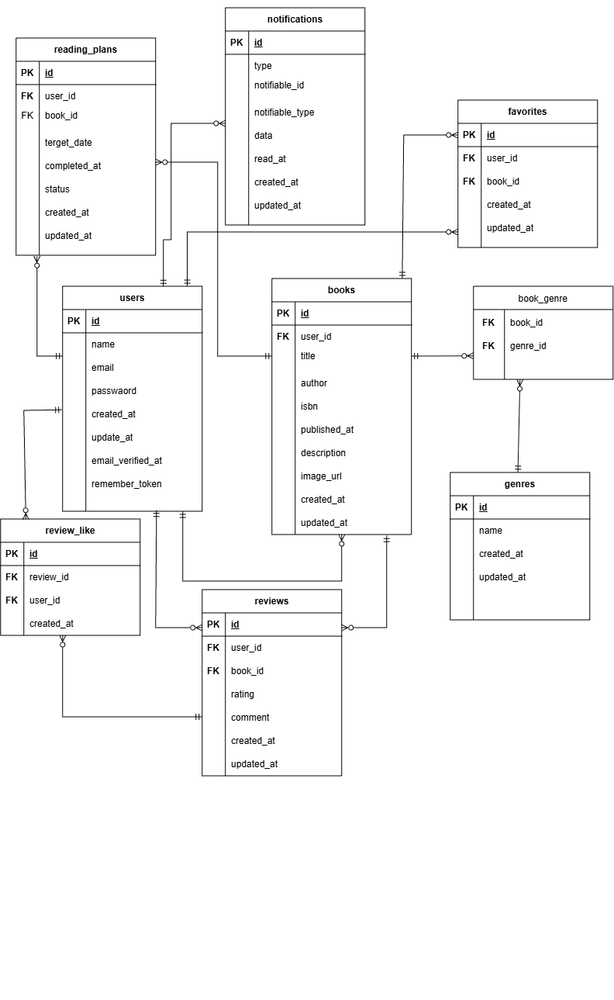

# Bookshelf APP (書籍レビューアプリ)  

書籍の登録・検索・更新・削除・レビュー投稿および外部連携用APIを提供するWebアプリケーションです  

## 概要  

本プロジェクトは、ユーザーが書籍を検索・管理しレビューや評価を投稿・共有できるプラットフォームです。  
また外部アプリケーションからのデータ操作に対応するため、RESTfulなAPI(一覧取得、詳細取得、新規登録、更新・削除)を実装しています。  

## 使用技術  

* **OS**:Dockerが動作する任意のOS(macOS,Windows/WSL2,Linux)  
* **バックエンド**:PHP 8.5/Laravel (PHP)
* **データベース**:MySQL 8.4
* **フロントエンド**:Vite/Tailwind CSS 3.4.0/@tailwindcss/forms/Alpine.js  
* **開発環境**：Docker/laravel sail/phpMyAdmin  
* **認証機能**:Laravel Fortify 

## ER図  


## 環境構築手順

Docker（Laravel Sail）を使用したセットアップ手順です。

### 前提条件
- Docker Desktop がインストールされていること
- WSL2（Windows の場合）または Terminal が利用可能であること

### 1. リポジトリのクローン

```bash
git clone https://github.com/mii4573/bookshelf-app
cd bookshelf-app
``` 

### 2.環境変数ファイルの作成

```bash
cp .env.example .env
```
.envファイル内のデータベース接続情報や環境変数を適宜変更してください

### 3. Composerパッケージのインストール

```bash
docker run --rm \
    -u "$(id -u):$(id -g)" \
    -v "$(pwd):/app" \
    composer:latest \
    install --ignore-platform-reqs
```

### 4.Sail(Dockerコンテナ)の起動

```bash
./vendor/bin/sail up -d
```

### 5.アプリケーションキーの生成

```bash
./vendor/bin/sail artisan key:generate
```

### 6.マイグレーションと初期データの投入

```bash
./vendor/bin/sail artisan migrate --seed
```

### 7.フロントエンドのアセットビルド

```bash
./vendor/bin/sail npm install
./vendor/bin/sail npm run dev
```

### 開発環境

* Webアプリケーション：http://localhost
* phpMyAdmin:http://localhost:8080

### APIエンドポイント一覧

外部アプリケーション連携用の RESTful API エンドポイントです。

| メソッド | エンドポイント | 説明 | パラメータ / 備考 |
| :--- | :--- | :--- | :--- |
| **GET** | `/api/v1/books` | 書籍一覧取得 | `keyword`（タイトル/著者検索）, `genre`（ジャンルID）, `per_page`（件数/デフォルト20） |
| **GET** | `/api/v1/books/{id}` | 書籍詳細取得 | 平均評価 (`reviews_avg_rating`)・レビュー件数 (`reviews_count`) を含む |
| **POST** | `/api/v1/books` | 書籍新規登録 | `title`, `author`, `genres` (配列) など。成功時: **201 Created** |
| **PUT** | `/api/v1/books/{id}` | 書籍情報更新 | 登録情報の更新・ジャンル紐付けの更新 |
| **DELETE** | `/api/v1/books/{id}` | 書籍削除 | 成功時: **204 No Content** (レスポンスボディなし) |

## 応用機能の実装について（advanceブランチ）

本アプリケーションでは、基礎機能（mainブランチ）に加え、さらに利便性を高めるための**応用機能の実装に挑戦した履歴を `advance` ブランチ**にて管理しています。

### advanceブランチで追加・設計した主な要素

1. **読書計画機能 (`reading_plans` テーブル)**
   - ユーザーが書籍ごとの目標達成日や進捗ステータス（未読・読書中・完了など）を管理できる機能。
2. **通知機能 (`notifications` テーブル)**
   - Laravel標準のデータベース通知を活用し、読書計画の期限などをリマインドするための基盤。
3. **拡張ER図およびテーブル仕様書**
   - 上記機能追加に伴うリレーション設計（`reading_plans` および `notifications` テーブルの追加）
   
#### 応用機能追加後のER図


### テストの実行方法

```bash
#　全テストの実行
./vendor/bin/sail artisan test
```

> Note:カバレッジ計測について
> カバレッジ計測は、普段の設計を無効化(コメントアウト)しています。
>計測時のみ設定を有効化したあとに**コンテナを再起動**してから以下のコマンドを実行してください。

```bash
#1.設定変更後、コンテナを再起動して設定を反映
./vendor/bin/sail restart

#2.カバレッジ付でテストを実行
./vendor/bin/sail artisan test --coverage

```
### 作成者：Minori Murakami
